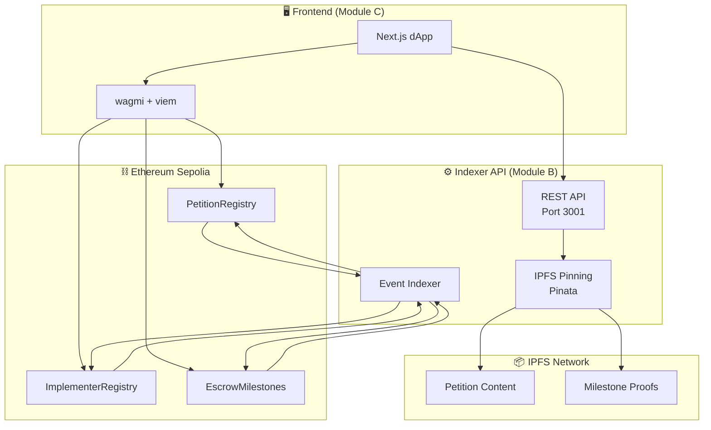
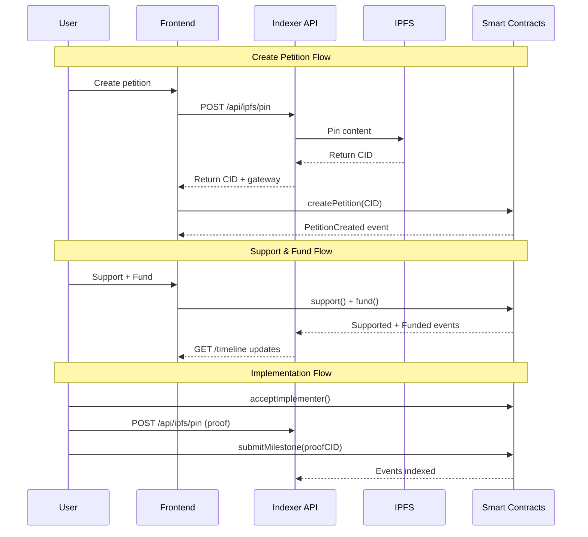
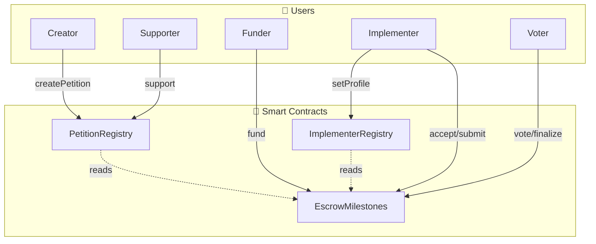
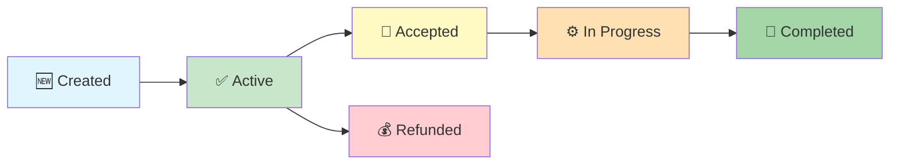
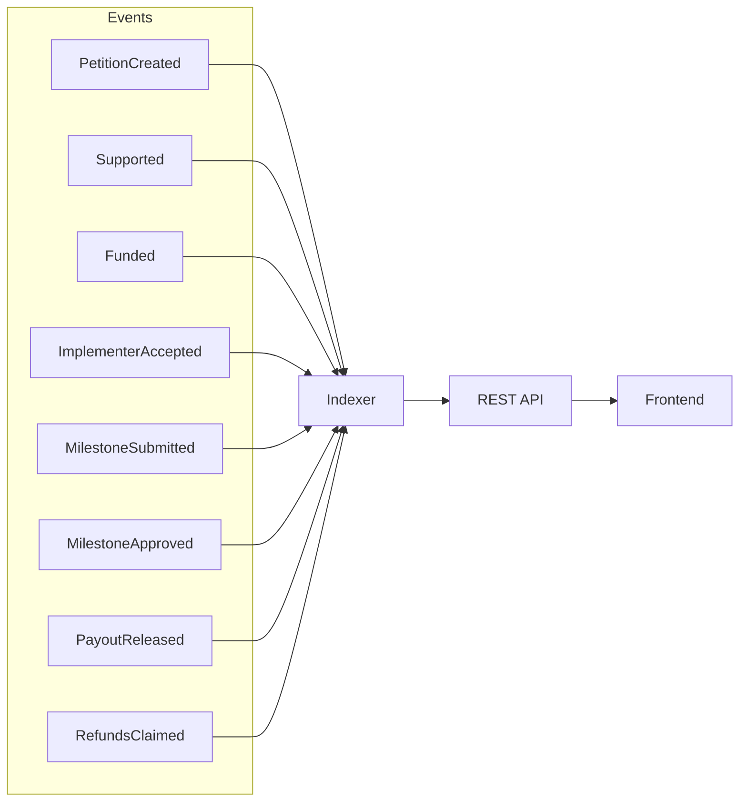

# 🗳️ OpenReform

**A Decentralized Petition-to-Action Platform on Ethereum**

OpenReform enables supporters to fund petitions into escrow with milestone-based payouts to implementers. Petition content and proofs live on IPFS, and an indexer-driven timeline shows progress from creation to payouts.


---

## 🏗️ System Architecture



---

## 🔄 Data Flow



---

## 📊 Contract Interactions



---

## 🎯 Petition Lifecycle



---

## 📜 Deployed Contracts (Sepolia Testnet)

| Contract | Address | Etherscan |
|----------|---------|-----------|
| **PetitionRegistry** | `0x7D377A56642aaE04A883A2f99F876F5b5142399e` | [View](https://sepolia.etherscan.io/address/0x7D377A56642aaE04A883A2f99F876F5b5142399e) |
| **ImplementerRegistry** | `0x5ce5bd6b6E6bDDFC71C1a4d64bc159E28bf909bf` | [View](https://sepolia.etherscan.io/address/0x5ce5bd6b6E6bDDFC71C1a4d64bc159E28bf909bf) |
| **EscrowMilestones** | `0x1a7a1e26dc55063f6b485619B7BAa86a222EFd5D` | [View](https://sepolia.etherscan.io/address/0x1a7a1e26dc55063f6b485619B7BAa86a222EFd5D) |

---

## 🚀 Quick Start

### Prerequisites
- Node.js 20+
- npm or yarn
- MetaMask wallet with Sepolia ETH

### 1. Clone & Install

```bash
git clone https://github.com/Hammaduddin561/OpenReform.git
cd OpenReform
```

### 2. Setup Indexer API (Module B)

```bash
cd indexer-api
npm install
cp .env.example .env
# Edit .env with your Pinata API keys
npm run dev
```

Server runs at `http://localhost:3001`

### 3. Setup Frontend (Module C)

```bash
cd frontend
npm install
npm run dev
```

Frontend runs at `http://localhost:3000`

---

## 📡 API Endpoints

| Method | Endpoint | Description |
|--------|----------|-------------|
| `GET` | `/api/health` | Health check + indexer status |
| `GET` | `/api/petitions` | List all petitions |
| `GET` | `/api/petitions/:id` | Get petition details |
| `GET` | `/api/petitions/:id/timeline` | Get petition event timeline |
| `POST` | `/api/ipfs/pin` | Pin content to IPFS |
| `GET` | `/api/events/raw` | Raw events (debug) |

### Example: Pin to IPFS

```bash
curl -X POST http://localhost:3001/api/ipfs/pin \
  -H "Content-Type: application/json" \
  -d '{"content": {"title": "My Petition", "description": "..."}, "name": "petition"}'
```

Response:
```json
{
  "cid": "QmXyz...",
  "gateway": "https://gateway.pinata.cloud/ipfs/QmXyz...",
  "timestamp": 1706959632593
}
```

---

## ⚡ Smart Contract Events



| Event | Description |
|-------|-------------|
| `PetitionCreated` | New petition created with IPFS CID |
| `Supported` | User supported a petition |
| `Funded` | ETH deposited to petition escrow |
| `ImplementerAccepted` | Implementer accepted the petition |
| `MilestoneSubmitted` | Proof submitted for milestone |
| `MilestoneApproved` | Milestone approved by voters |
| `PayoutReleased` | ETH released to implementer |
| `RefundsClaimed` | Refunds claimed after deadline |

---

## 🔧 Development

### Contracts (Module A)

```bash
cd contracts
npm install
npx hardhat compile
npx hardhat test

# Deploy to Sepolia
cp .env.example .env
# Add DEPLOYER_PRIVATE_KEY to .env
npx hardhat ignition deploy ignition/modules/OpenReform.ts --network sepolia
```

### Indexer API (Module B)

```bash
cd indexer-api
npm install
npm run dev      # Development with hot reload
npm run build    # Production build
npm start        # Production server
```

---

## 📁 Project Structure

```
OpenReform/
├── contracts/              # Hardhat + Solidity contracts
│   ├── contracts/          # Smart contract source files
│   ├── ignition/           # Deployment modules
│   └── test/               # Contract tests
├── indexer-api/            # Event indexer + REST API
│   ├── src/
│   │   ├── services/       # IPFS, indexer logic
│   │   ├── routes/         # API endpoints
│   │   └── index.ts        # Server entry
│   └── package.json
├── frontend/               # Next.js dApp (Module C)
├── shared/                 # Shared types, ABIs, constants
│   ├── event-schema.ts     # Event type definitions
│   └── deployed-addresses.json
└── README.md
```

---

## 🔗 Links

- **GitHub**: https://github.com/Hammaduddin561/OpenReform
- **Sepolia Faucet**: https://sepoliafaucet.com/
- **Pinata (IPFS)**: https://pinata.cloud/

---

## 📄 License

MIT License - see [LICENSE](LICENSE) for details.

---

Built with ❤️ for hackathon